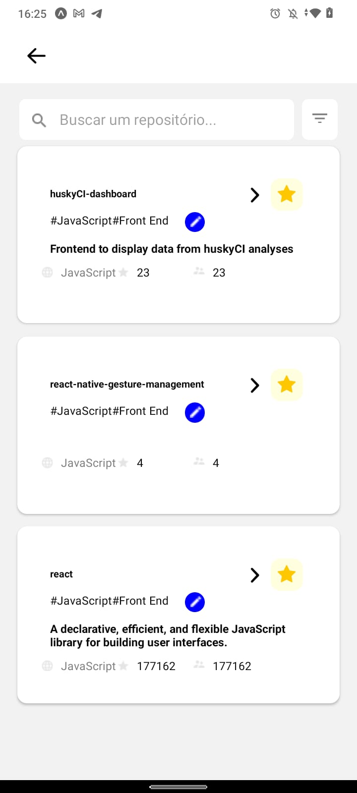
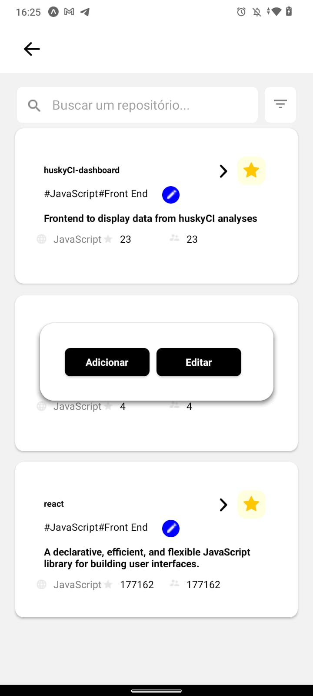
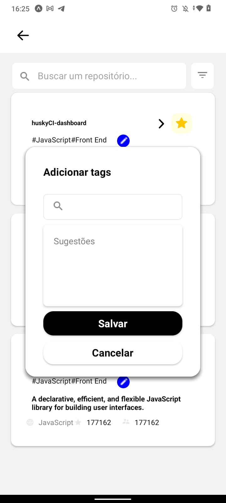
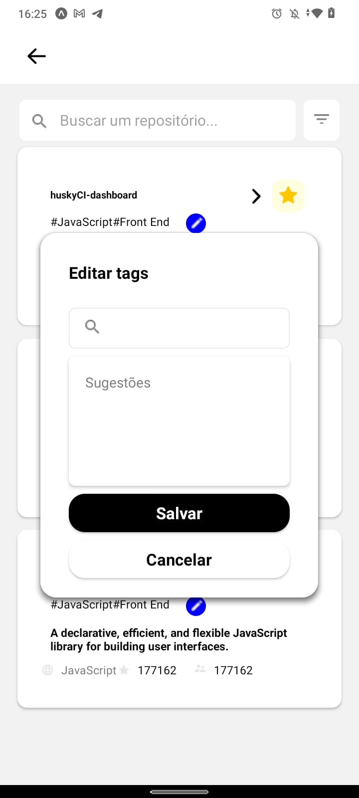

    

    
    
    
    
    
    
    

    

    DESAFIO GOK
    

    
STEPS TO START

    
1: install dependencies with: (npm install or yarn)

    
if dispositive ios (cd ios after pod install)

    
2: run app: (yarn android or yarn ios)

